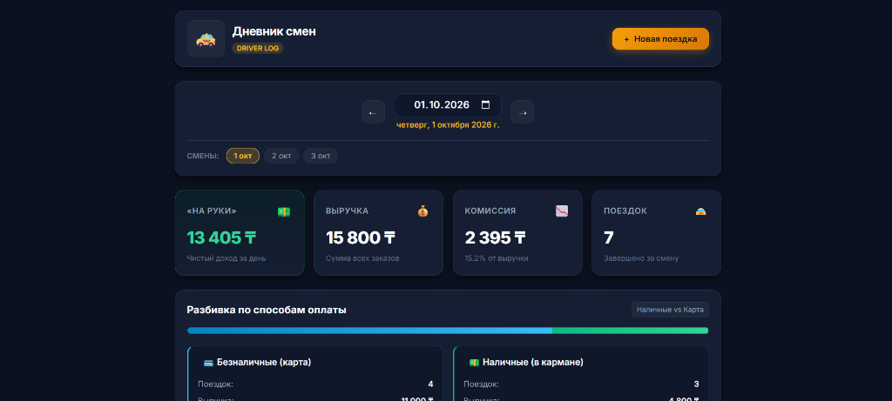

# 🚕 Дневник смен водителя (Driver Shift Log)

Полнофункциональное веб- и серверное приложение для учета рабочих смен таксиста / водителя.



Проект включает:
- **REST API** на FastAPI с автоматической интерактивной документацией Swagger / OpenAPI.
- **Интерактивный веб-клиент** в стиле мобильного/планшетного терминала водителя (темная тема, переключение дней, KPI-карточки, диаграмма распределения безнал/нал, список поездок, модальное окно добавления с «живой» валидацией).
- **Консольный клиент (CLI)** с поддержкой аргументов командной строки и интерактивного меню.
- **Комплекс тестов** на `pytest` (расчет сводки, защита от дублей, граничные условия, часовые пояса, валидация).

---

## 📋 Что реализовано

1. **Сервер API**:
   - `GET /api/summary?date=YYYY-MM-DD` — суточная сводка: число поездок, общая выручка, комиссия, заработок «на руки», детальная разбивка наличные / карта.
   - `GET /api/trips?date=YYYY-MM-DD` — список всех поездок за указанный день, отсортированный по времени начала.
   - `GET /api/shift?date=YYYY-MM-DD` — объединенный эндпоинт для клиента: сводка + поездки + список доступных дат со сменами.
   - `POST /api/trips` — добавление новой поездки с валидацией (`amount > 0`, `end > start`, `commission <= amount`) и **защитой от дублей**.
   - `GET /api/dates` — список всех дат, в которые зафиксированы поездки.

2. **Защита от дублей (Deduplication)**:
   - Если отправляется поездка с уже существующим `id` — запись в хранилище не задваивается, возвращается статус 200 с флагом `is_duplicate: true`.
   - Если отправляется поездка без `id` (или с новым id), но с идентичными параметрами (`start`, `end`, `amount`, `payment`, `commission`), система распознает её по цифровому отпечатку (fingerprint) и возвращает существующую запись без дублирования.

3. **Клиент**:
   - Красивый адаптивный веб-интерфейс (отлично выглядит на смартфонах и ПК).
   - Навигатор дней: кнопки «◀ Предыдущий» / «Следующий ▶», выбор даты через календарь, быстрые чипсы по имеющимся сменам.
   - Наглядная разбивка выручки: цветной прогресс-бар соотношения Карта / Наличные, суммы комиссий и чистый остаток («на руки»).
   - Кнопка **«🛡 Проверить защиту от дублей»** прямо в интерфейсе для наглядной демонстрации работы алгоритма дедупликации.

---

## 🚀 Быстрый запуск

### 1. Установка зависимостей
Требуется Python 3.10+:
```bash
pip install -r requirements.txt
```

### 2. Запуск сервера и веб-клиента
```bash
python main.py
```
После запуска откройте в браузере:
- **Веб-клиент:** [http://127.0.0.1:8000/](http://127.0.0.1:8000/)
- **Интерактивная документация Swagger API:** [http://127.0.0.1:8000/docs](http://127.0.0.1:8000/docs)

---

## 🧪 Запуск тестов

Тесты покрывают расчет сводки, балансовые соотношения, дедупликацию, валидацию и граничные условия:
```bash
pytest -v
```

Все 18 тестов выполняются менее чем за 1 секунду:
- `tests/test_summary.py` — расчет сводки за день (включая пример из ТЗ), пустые дни, смены только за нал/безнал.
- `tests/test_duplicates.py` — защита от повторной отправки по ID и по набору параметров без дублирования файла.
- `tests/test_validation.py` — проверка `amount > 0`, `end > start`, отрицательной комиссии, недопустимых типов оплаты.
- `tests/test_edge_cases.py` — проверка часовых поясов (+05:00), вычисляемых свойств модели, многократной идемпотентности.
- `tests/test_api.py` — интеграционные тесты HTTP-эндпоинтов FastAPI.

---

## 💻 Использование консольного клиента (CLI)

Сервер также поддерживает работу через CLI:

```bash
# Получить сводку за день
python client.py summary --date 2026-10-01

# Получить список поездок за день
python client.py trips --date 2026-10-01

# Добавить поездку
python client.py add --start 2026-10-01T17:00:00+05:00 --end 2026-10-01T17:35:00+05:00 --amount 1800 --payment card --commission 270

# Запустить интерактивное меню
python client.py interactive
```

---

## 📁 Структура проекта

```text
├── app/
│   ├── api.py           # Маршруты FastAPI (/api/shift, /api/summary, /api/trips)
│   ├── models.py        # Pydantic-схемы (Trip, TripCreate, DaySummary, PaymentSummary)
│   ├── service.py       # Бизнес-логика: фильтрация по дням, расчет сводки, агрегация
│   └── storage.py       # Потокобезопасное хранилище JSON с защитой от дублей
├── data/
│   ├── sample_trips.json # Исходные данные с примером из ТЗ
│   └── trips.json        # Активная база поездок
├── static/
│   ├── app.js           # Логика клиента (переключение дней, расчеты, алерты)
│   ├── index.html       # Шаблон интерфейса водителя
│   └── styles.css       # Стили (темная тема, адаптивная верстка)
├── tests/
│   ├── test_api.py
│   ├── test_duplicates.py
│   ├── test_edge_cases.py
│   ├── test_summary.py
│   └── test_validation.py
├── client.py            # Консольный клиент (CLI и интерактивный режим)
├── main.py              # Точка входа веб-приложения
├── requirements.txt     # Зависимости
└── README.md            # Документация проекта
```

---

## 📝 Ответы для анкеты

### 1. Как использовался ИИ:
ИИ использовался как архитектурный и парный ассистент:
- Быстрое проектирование схемы данных (Pydantic-модели) и REST API на FastAPI.
- Написание тестов на граничные условия и генерация репрезентативного набора смен.
- Создание адаптивного фронтенда для водителя без сторонних тяжелых библиотек (чистый HTML5/CSS3/Vanilla JS).

### 2. Где ИИ ошибся и что было исправлено вручную:
1. **Часовые пояса и границы суток:** ИИ сначала предложил парсить время через строковый срез `start[:10]`. Однако при наличии смещения часового пояса (например, `+05:00`) поездка, начатая в 01:30 ночи, в UTC принадлежит предыдущему дню. Исправлено на корректный парсинг `datetime.fromisoformat()` с фильтрацией по локальной дате смены `trip.start.date()`.
2. **Защита от дублей без ID:** Изначально ИИ проверял только совпадение поля `id`. В реальных условиях мобильное приложение водителя может повторно отправить офлайн-запрос без заданного ID при сбое сети. Добавлен механизм вычисления фингерпринта параметров `(start_ts, end_ts, amount, payment, commission)`, предотвращающий создание дублей даже без ID.
3. **Статус-код ответа в FastAPI:** При передаче объекта `response: Response` в обработчик роута FastAPI по умолчанию выставляет статус 200, если он не переопределен явно, перетирая декоратор `status_code=201`. Было исправлено явным выставлением статуса: `201 Created` для новых поездок и `200 OK` для распознанных дубликатов.
4. **Кодировка консоли Windows:** В CLI-клиенте на Windows вывод эмодзи в `cp1251` приводил к `UnicodeEncodeError`. Была добавлена безопасная переконфигурация потока `sys.stdout.reconfigure(encoding='utf-8')` и текстовые метки.
